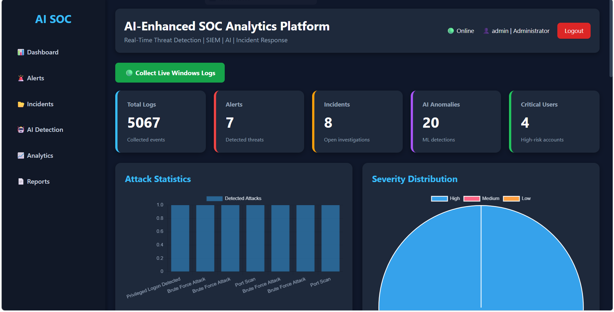
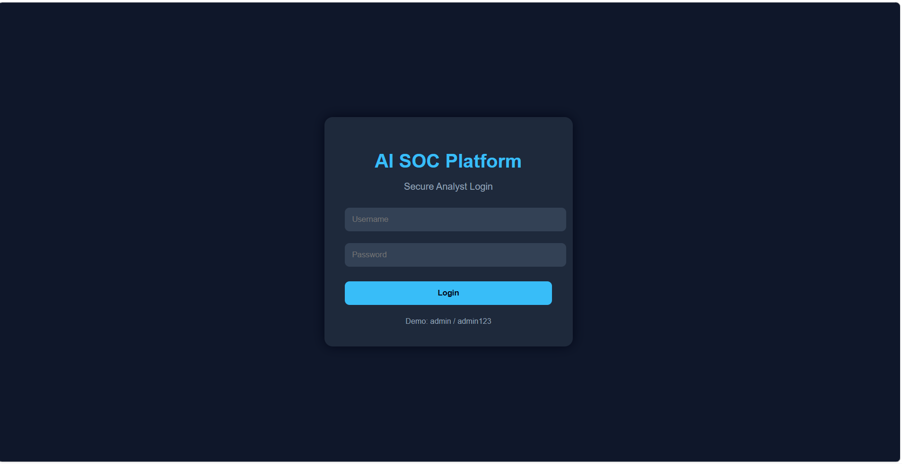
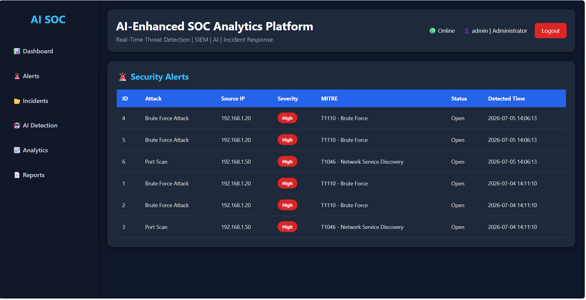
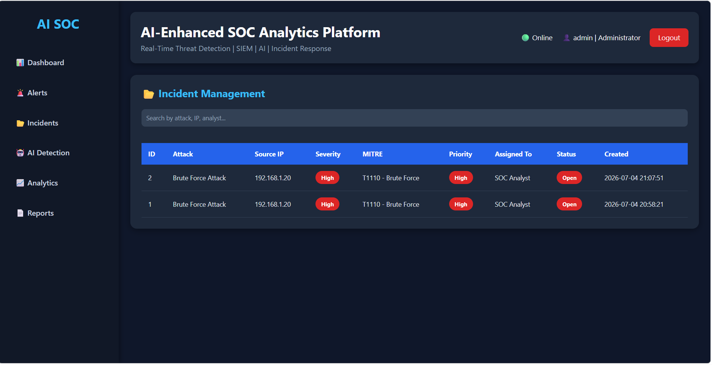
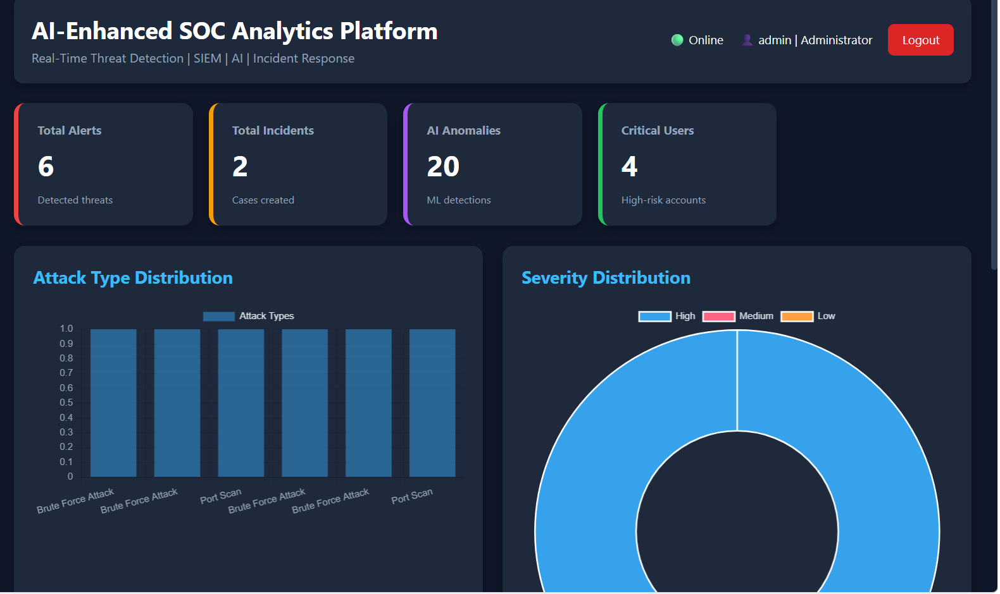
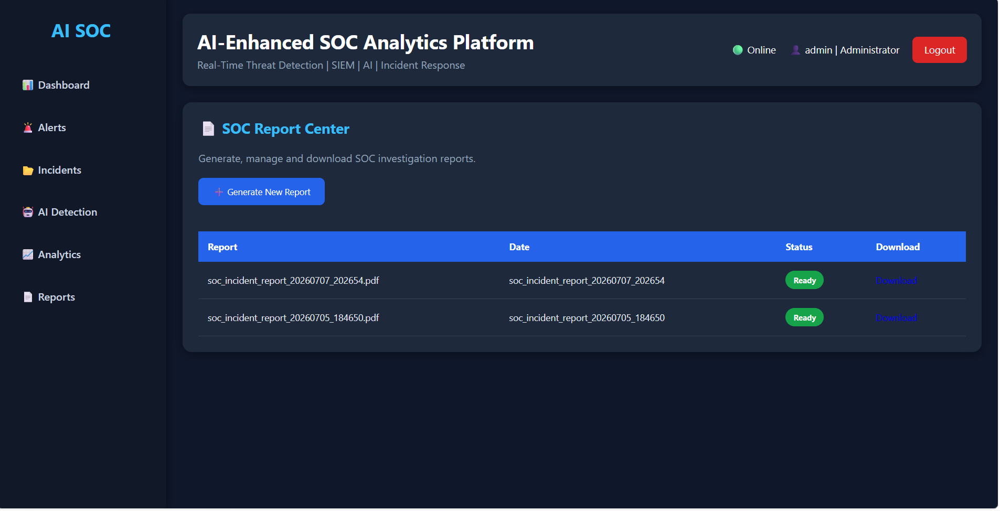

# 🛡️ AI-Enhanced SOC Analytics Platform




AI-Enhanced SOC Analytics Platform is a real-time Security Operations Center (SOC) application that collects Windows event logs, detects cyber threats using rule-based and AI-based analysis, automatically creates incidents, and visualizes security events through a modern dashboard.

---

# 📌 Overview

The AI-Enhanced SOC Analytics Platform simulates the workflow of a modern Security Operations Center.

The platform collects security logs, detects attacks using rule-based detection and AI techniques, creates alerts and incidents automatically, and visualizes security information through a web dashboard.

---

# 🏆 Project Highlights

- ✅ Live Windows Security Event Collection
- ✅ Real-Time Log Ingestion
- ✅ AI-Based Anomaly Detection
- ✅ Automatic Incident Creation
- ✅ MITRE ATT&CK Mapping
- ✅ PDF Report Generation
- ✅ Interactive Dashboard
- ✅ GitHub Version Control


# 🚀 Roadmap

- [x] Live Windows Logs
- [x] AI Detection
- [x] Incident Management
- [x] Dashboard Analytics
- [ ] Linux Log Collection
- [ ] Firewall Integration
- [ ] Threat Intelligence
- [ ] Docker Deployment
- [ ] Cloud Deployment

# 🚀 Features

## Authentication

- Secure Login
- User Sessions
- Role-based Access

## Live Log Collection

- Windows Event Logs
- Windows Security Logs
- Live Log Ingestion

## Detection Engine

- Brute Force Detection
- Port Scan Detection
- Privileged Logon Detection
- Suspicious Account Creation Detection

## AI Engine

- AI Anomaly Detection
- Risk Scoring
- Threat Analysis

## Incident Management

- Automatic Incident Creation
- Duplicate Prevention
- Incident Tracking

## Dashboard

- Live Dashboard
- Alerts
- Incidents
- Analytics
- Reports

---

# 🏗️ Architecture

```text
Windows Logs
      │
      ▼
Collector
      │
      ▼
Parser
      │
      ▼
MySQL
      │
      ▼
Detection Engine
      │
      ├── Brute Force
      ├── Port Scan
      ├── Privilege Escalation
      └── Account Creation
      │
      ▼
AI Engine
      │
      ▼
Risk Engine
      │
      ▼
Alert Engine
      │
      ▼
Incident Engine
      │
      ▼
Dashboard
```

---

# 🛠️ Technologies

- Python
- Flask
- MySQL
- HTML
- CSS
- JavaScript
- Chart.js
- ReportLab
- Scikit-learn
- Pandas
- Joblib
- PyWin32
- Git & GitHub

---

# 📂 Project Structure

```text
src/
 ├── auth
 ├── collector
 ├── dashboard
 ├── database
 ├── detection
 ├── reports
 └── services
```

---

# ▶️ Installation

```bash
git clone https://github.com/Fathaaa-05/AI-Enhanced-SOC-Analytics-Platform.git
cd AI-Enhanced-SOC-Analytics-Platform
pip install -r requirements.txt
python app.py
```

---

# 🔍 Detection Rules

- Brute Force Attack
- Port Scan
- Privileged Logon (Event ID 4672)
- User Account Creation (Event ID 4720)

---

# 🤖 AI Capabilities

- AI-based anomaly detection
- Risk scoring
- Alert prioritization

---

# 📈 Future Enhancements

- Linux Log Collection
- Firewall Integration
- Threat Intelligence
- Docker Deployment
- Cloud Deployment
- Email Notifications
- Multi-machine SOC Monitoring

---


## Login



## Dashboard


## Alerts



## Incidents



## Analytics



## Reports



# 👨‍💻 Author

**Abdul Fathah**

Cybersecurity | SOC | AI | Python | Flask